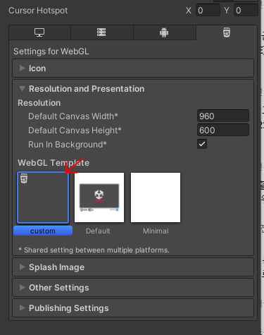

# Title

## Sub Title
- item1
- item2

~~~C#
Code
~~~

- Link [link](https://www.naver.com)
- Image 
- :link: GitHub Emoji list [link](https://gist.github.com/rxaviers/7360908)
<pre><code>
text
</code></pre>

# table (제목 아래 한 줄 공백 추가 되어야 함.)

| Title | Sub title |
| ---- | ---- |
| Data | Data 1 |
