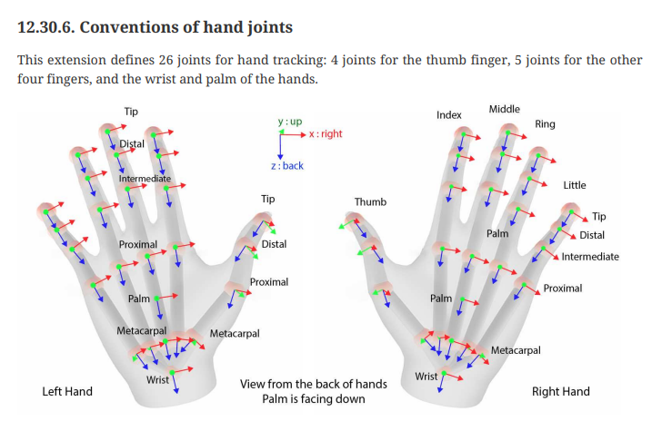

# OpenXR Hand Extension
openxr 관련해서 개발하면서 이번에는 hand 에 관련 된 내용을 좀 정리해 보려고 한다.
openxr 에서는 일반적인 컨트롤러와는 다르게 hand는 extension으로 구현 되어 있다.

# API 설명
xrCreateHandTrackerEXT 를 통해서 hand handle 을 만들고, 
xrLocateHandJointsEXT 를 통해서 hand 위치를 받게 된다. 
핸드 사용을 마치고 싶으면 xrDestroyHandTrackerEXT 를 호출한다.

# Hand Joints
핸드는 26개의 joint로 이루어져 있으며,
아래와 같은 enum 순서로 손가락 관절의 position 값을 가져올 수 있다.

<pre><code>
// Provided by XR_EXT_hand_tracking
typedef enum XrHandJointEXT {
  XR_HAND_JOINT_PALM_EXT = 0,
  XR_HAND_JOINT_WRIST_EXT = 1,
  XR_HAND_JOINT_THUMB_METACARPAL_EXT = 2,
  XR_HAND_JOINT_THUMB_PROXIMAL_EXT = 3,
  XR_HAND_JOINT_THUMB_DISTAL_EXT = 4,
  XR_HAND_JOINT_THUMB_TIP_EXT = 5,
  XR_HAND_JOINT_INDEX_METACARPAL_EXT = 6,
  XR_HAND_JOINT_INDEX_PROXIMAL_EXT = 7,
  XR_HAND_JOINT_INDEX_INTERMEDIATE_EXT = 8,
  XR_HAND_JOINT_INDEX_DISTAL_EXT = 9,
  XR_HAND_JOINT_INDEX_TIP_EXT = 10,
  XR_HAND_JOINT_MIDDLE_METACARPAL_EXT = 11,
  XR_HAND_JOINT_MIDDLE_PROXIMAL_EXT = 12,
  XR_HAND_JOINT_MIDDLE_INTERMEDIATE_EXT = 13,
  XR_HAND_JOINT_MIDDLE_DISTAL_EXT = 14,
  XR_HAND_JOINT_MIDDLE_TIP_EXT = 15,
  XR_HAND_JOINT_RING_METACARPAL_EXT = 16,
  XR_HAND_JOINT_RING_PROXIMAL_EXT = 17,
  XR_HAND_JOINT_RING_INTERMEDIATE_EXT = 18,
  XR_HAND_JOINT_RING_DISTAL_EXT = 19,
  XR_HAND_JOINT_RING_TIP_EXT = 20,
  XR_HAND_JOINT_LITTLE_METACARPAL_EXT = 21,
  XR_HAND_JOINT_LITTLE_PROXIMAL_EXT = 22,
  XR_HAND_JOINT_LITTLE_INTERMEDIATE_EXT = 23,
  XR_HAND_JOINT_LITTLE_DISTAL_EXT = 24,
  XR_HAND_JOINT_LITTLE_TIP_EXT = 25,
  XR_HAND_JOINT_MAX_ENUM_EXT = 0x7FFFFFFF
} XrHandJointEXT;
</code></pre>

위 구조체 대로 가져오면 아래의 이미지와 같은 hand bone을 만들 수 있다.

# Python Code

<pre><code>
from enum import Enum

class HandJoint(Enum):
    # PALM
    PALM_EXT = 0
    WRIST_EXT = 1
    # THUMB
    THUMB_METACARPAL_EXT = 2
    THUMB_PROXIMAL_EXT = 3
    THUMB_DISTAL_EXT = 4
    THUMB_TIP_EXT = 5
    # INDEX
    INDEX_METACARPAL_EXT = 6
    INDEX_PROXIMAL_EXT = 7
    INDEX_INTERMEDIATE_EXT = 8
    INDEX_DISTAL_EXT = 9
    INDEX_TIP_EXT = 10
    # MIDDLE
    MIDDLE_METACARPAL_EXT = 11
    MIDDLE_PROXIMAL_EXT = 12
    MIDDLE_INTERMEDIATE_EXT = 13
    MIDDLE_DISTAL_EXT = 14
    MIDDLE_TIP_EXT = 15
    # RING
    RING_METACARPAL_EXT = 16
    RING_PROXIMAL_EXT = 17
    RING_INTERMEDIATE_EXT = 18
    RING_DISTAL_EXT = 19
    RING_TIP_EXT = 20
    # LITTLE
    LITTLE_METACARPAL_EXT = 21
    LITTLE_PROXIMAL_EXT = 22
    LITTLE_INTERMEDIATE_EXT = 23
    LITTLE_DISTAL_EXT = 24
    LITTLE_TIP_EXT = 25
    MAX_ENUM_EXT = 0x7FFFFFFF

hand_bone_map = [
    # PALM
    (HandJoint.WRIST_EXT, HandJoint.PALM_EXT),
    # THUMB
    (HandJoint.WRIST_EXT, HandJoint.THUMB_METACARPAL_EXT),
    (HandJoint.THUMB_METACARPAL_EXT, HandJoint.THUMB_PROXIMAL_EXT),
    (HandJoint.THUMB_PROXIMAL_EXT, HandJoint.THUMB_DISTAL_EXT),
    (HandJoint.THUMB_DISTAL_EXT, HandJoint.THUMB_TIP_EXT),
    # INDEX
    (HandJoint.WRIST_EXT, HandJoint.INDEX_METACARPAL_EXT),
    (HandJoint.INDEX_METACARPAL_EXT, HandJoint.INDEX_PROXIMAL_EXT),
    (HandJoint.INDEX_PROXIMAL_EXT, HandJoint.INDEX_INTERMEDIATE_EXT),
    (HandJoint.INDEX_INTERMEDIATE_EXT, HandJoint.INDEX_DISTAL_EXT),
    (HandJoint.INDEX_DISTAL_EXT, HandJoint.INDEX_TIP_EXT),
    # MIDDLE
    (HandJoint.WRIST_EXT, HandJoint.MIDDLE_METACARPAL_EXT),
    (HandJoint.MIDDLE_METACARPAL_EXT, HandJoint.MIDDLE_PROXIMAL_EXT),
    (HandJoint.MIDDLE_PROXIMAL_EXT,  HandJoint.MIDDLE_INTERMEDIATE_EXT),
    (HandJoint.MIDDLE_INTERMEDIATE_EXT, HandJoint.MIDDLE_DISTAL_EXT),
    (HandJoint.MIDDLE_DISTAL_EXT,  HandJoint.MIDDLE_TIP_EXT),
    # RING
    (HandJoint.WRIST_EXT, HandJoint.RING_METACARPAL_EXT),
    (HandJoint.RING_METACARPAL_EXT, HandJoint.RING_PROXIMAL_EXT),
    (HandJoint.RING_PROXIMAL_EXT, HandJoint.RING_INTERMEDIATE_EXT),
    (HandJoint.RING_INTERMEDIATE_EXT, HandJoint.RING_DISTAL_EXT),
    (HandJoint.RING_DISTAL_EXT, HandJoint.RING_TIP_EXT),
    # LITTLE
    (HandJoint.WRIST_EXT, HandJoint.LITTLE_METACARPAL_EXT),
    (HandJoint.LITTLE_METACARPAL_EXT, HandJoint.LITTLE_PROXIMAL_EXT),
    (HandJoint.LITTLE_PROXIMAL_EXT, HandJoint.LITTLE_INTERMEDIATE_EXT),
    (HandJoint.LITTLE_INTERMEDIATE_EXT, HandJoint.LITTLE_DISTAL_EXT),
    (HandJoint.LITTLE_DISTAL_EXT, HandJoint.LITTLE_TIP_EXT),
]
</code></pre>
이걸 파이썬으로 만들면 위와 같은 코드가 된다.
이걸 왜 하느냐??? 그건 blender에서 python으로 armature를 자동으로 만들어 볼려고 한다.

<pre><code>
hand_joint_position = {
    HandJoint.WRIST_EXT : (0,0,0),
    HandJoint.PALM_EXT : (0,0,0),
    HandJoint.THUMB_METACARPAL_EXT : (0,0,0),
    HandJoint.THUMB_PROXIMAL_EXT : (0,0,0),
    HandJoint.THUMB_DISTAL_EXT : (0,0,0),
    HandJoint.THUMB_TIP_EXT : (0,0,0),
    HandJoint.INDEX_METACARPAL_EXT : (0,0,0),
    HandJoint.INDEX_PROXIMAL_EXT : (0,0,0),
    HandJoint.INDEX_INTERMEDIATE_EXT : (0,0,0),
    HandJoint.INDEX_DISTAL_EXT : (0,0,0),
    HandJoint.INDEX_TIP_EXT : (0,0,0),
    HandJoint.MIDDLE_METACARPAL_EXT : (0,0,0),
    HandJoint.MIDDLE_PROXIMAL_EXT : (0,0,0),
    HandJoint.MIDDLE_INTERMEDIATE_EXT : (0,0,0),
    HandJoint.MIDDLE_DISTAL_EXT : (0,0,0),
    HandJoint.MIDDLE_TIP_EXT : (0,0,0),
    HandJoint.RING_METACARPAL_EXT : (0,0,0),
    HandJoint.RING_PROXIMAL_EXT : (0,0,0),
    HandJoint.RING_INTERMEDIATE_EXT : (0,0,0),
    HandJoint.RING_DISTAL_EXT : (0,0,0),
    HandJoint.RING_TIP_EXT : (0,0,0),
    HandJoint.LITTLE_METACARPAL_EXT : (0,0,0),
    HandJoint.LITTLE_PROXIMAL_EXT : (0,0,0),
    HandJoint.LITTLE_INTERMEDIATE_EXT : (0,0,0),
    HandJoint.LITTLE_DISTAL_EXT : (0,0,0),
    HandJoint.LITTLE_TIP_EXT : (0,0,0),
}
</code></pre>
이런 형식으로 hand position 데이터를 생성한 후, (물론 값은 0,0,0 아니라 실제 값이어야 한다.)

# Blender code
- Blender Armature Script Link (https://docs.blender.org/api/current/bpy.ops.armature.html)
- Blender Object Script Link (https://docs.blender.org/api/current/bpy.ops.object.html)

<pre><code>
import bpy
_armature = None 
_ebs = None

def init():
    _armature = bpy.context.active_object
    _ebs = _armature.data.edit_bones
    
    # 새로운 Armature 생성
    bpy.ops.object.armature_add(radius=1.0, enter_editmode=False, align='WORLD', location=(0.0, 0.0, 0.0), rotation=(0.0, 0.0, 0.0), scale=(0.0, 0.0, 0.0))

    # 우선 Edit 모드로 변경
    bpy.ops.object.mode_set(mode='EDIT', toggle=False)

def create_bone(name, head, tail):
    eb = _ebs.new(name)
    eb.head = head
    eb.tail = tail
    return eb

def link(parent, child):
    parent = _armature.data.edit_bones[parent]
    child = _armature.data.edit_bones[child]
    child.parent = parent
    child.use_connect = True

def create_bones():
    for joint in range(0,len(hand_bone_map)):
        j = hand_bone_map[joint]
        parent = j[0]
        child = j[1]

        parent_pos = hand_joint_position[parent]
        child_pos = hand_joint_position[child]

        print(child.name, parent_pos, child_pos)
        create_bone(child.name, parent_pos, child_pos)
        link(parent.name, child.name)

init()
create_bones()
</code></pre>

이렇게 코드를 작성하고 blender 상에서 python script를 실행하면,  
hand bone을 생성 할 수 있고,  
hand mesh를 만들고 armature와  
armature deform에서 with automatic weights로 bone을 연결해서, 
asset을 만들고, 이를 openxr hand tracking api 과 연결하면 hand가 움직이는 걸 볼 수 있다. 
