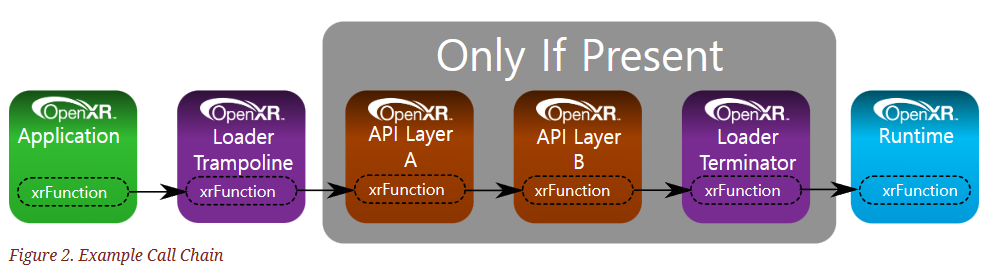

# openxr loader

openxr에서는 runtime의 함수를 loader를 통해서 가져온다.
그리고 application과 runtime의 함수를 연결해 주는 역할을 하는게 loader이다.
그래서 loader는 client에 static libary 형태로 빌드 시에 포함이 되고,
loader는 openxr runtime을 찾아서 so file을 load해 주고, openxr 함수들을 실행 할 수 있도록,
function pointer를 제공해 준다. 아래의 그림을 보면 좀 더 이해 하기 쉽다.

그럼 이렇게 function pointer를 제공해 주기 위해서는 function proto-type과 define들이 정의 되어야할 필요가 있고,
이를 제공해 주기 위해 아래의 repo에서 loader 와 헤더 파일을 제공해 준다.

- [loader reop](https://github.com/KhronosGroup/OpenXR-SDK)
- [header file](https://github.com/KhronosGroup/OpenXR-SDK/blob/main/include/openxr/openxr.h)
- [platform header](https://github.com/KhronosGroup/OpenXR-SDK/blob/main/include/openxr/openxr_platform.h)

openxr 은 c로 개발 되어 있고, c로 개발할 경우 설정해 줘야 하는 파라미터가 많고, 개발하면서 코드가 길어져서 좀 불편할 수도 있다. 그래서 openxr api를 C++ 형태로 다시 wrapping 해준 프로젝트가 있는데, 이게 바로. OpenXR-Hpp (https://github.com/KhronosGroup/OpenXR-Hpp) 이다.

그런데, 실제로 native client를 개발할 일이 없으면 둘 다 거의 쓸일이 없다.
반면에 유니티를 개발하게 된다면, 이보다는 CSharp Wrapping class가 더 필요 할 수도 있다.

그래서 이번에 C# class를 개발해 볼까 한다.

내가 구현 하려고 하는 repo link는 여기 있다. [github link](https://github.com/fnwinter/OpenXR-SDK-CSharp)

