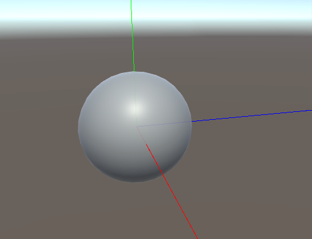

# why?
* 관절마다 붙여서 rotation vector를 좀 확인해 보고 싶어서 gizmo 코드 만들어 보았다.

# code
- [TransformPoint](https://docs.unity3d.com/ScriptReference/Transform.TransformPoint.html)
<pre><code>
using UnityEngine;

public class DebugGizmo : MonoBehaviour
{
    public bool enable = true;
    public float length = 2.0f;

    void Update()
    {
        if (enable)
        {
            Vector3 this_position = transform.position;

            Vector3 upward_ = transform.TransformPoint(Vector3.up * length);
            Vector3 forward_ = transform.TransformPoint(Vector3.forward * length);
            Vector3 right_ = transform.TransformPoint(Vector3.right * length);

            Debug.DrawLine(this_position, upward_, Color.green);
            Debug.DrawLine(this_position, forward_, Color.blue);
            Debug.DrawLine(this_position, right_, Color.red);
        }
    }
}
</code></pre>

# gizmo screen shot
