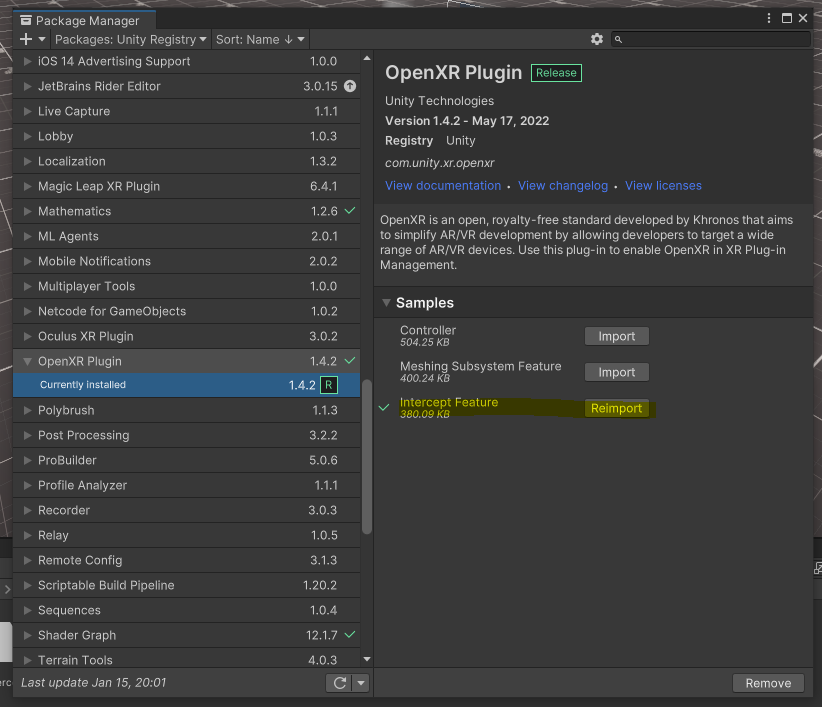

# OpenXR Unity Plugin

- Unity OpenXR Plugin는 기본적인 기능만 제공한다. 예를 들면, HeadTracking, Controller.
만약 OpenXR에서 제공하는 추가적인 기능들을 구현하고 싶으면 어떻게 해야 될까?
- Unity에서는 예제 코드를 아주 조금 보여주고 있다. 여기서 아주 조금은, 실제로 Native 코드가
없어서 완전한 설명이 안되고 말 그대로 이렇게 하면 된다 정도로만 설명하고 있다.

## 예제 코드
- Unity 에서 Package Manager를 실행하고, OpenXR Plugin을 설치한다.
- 그리고 아래 그림처럼 Intercept Feature를 Import 한다.
- InterceptFeature 
    - 
- 그러면 아래의 코드를 볼 수 있고, 이 코드는 OpenXR의 xrGetInstanceProcAddr 함수를 Hooking 하는 코드이다.
    - [xrGetInstanceProcAddr](https://registry.khronos.org/OpenXR/specs/1.0/man/html/xrGetInstanceProcAddr.html)
- 좀 더 자세히 설명하면 Unity 내부에서 원래의 xrGetInstanceProcAddr 포인터를 넘겨주고,
  새로운 Native Pointer를 얻어오는 함수인 것이다.

~~~C#
    protected override IntPtr HookGetInstanceProcAddr(IntPtr func)
    {
        Debug.Log("EXT: registering our own xrGetInstanceProcAddr");
        return intercept_xrCreateSession_xrGetInstanceProcAddr(func);
    }
~~~

- 아쉽게 예제에는 Native 코드가 없어서 더 이상 예제만으로 설명할 수 있는 방법이 없다.
- 하지만 다른 OpenXR Plugin 을 구현한 Vendor를 코드를 보면 좀 더 힌트를 얻을 수 있다.
