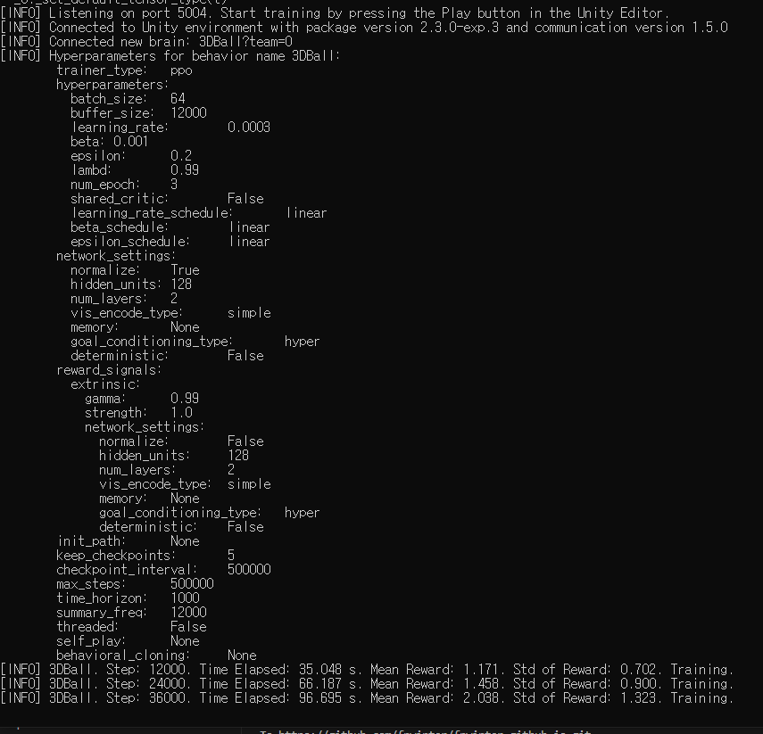
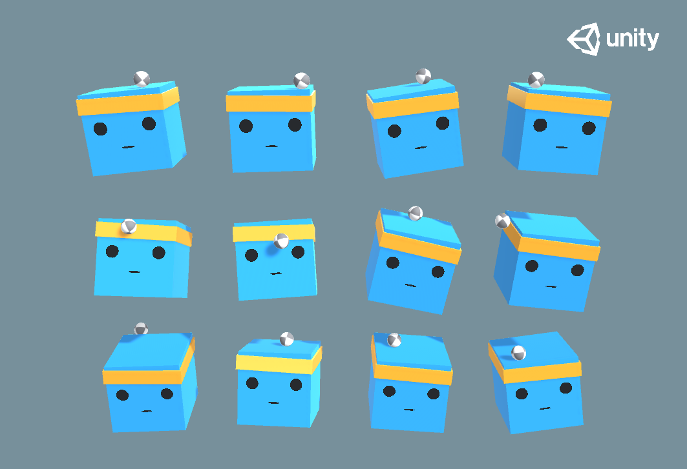

# ML-Agents 설치 시작하기
- ML Agents 책이 있었는데, 한동안 잊고 있다가, 다시 책을 펴 보았다.
- 책을 펼친 김에 설치 방법 정리해 보았다.
- 공식 가이드 [Link](https://unity-technologies.github.io/ml-agents/)
- 이전에 Unity-ML 책이 있었는데, 보니까 다 Tensorflow 기반이었고, 2.0 버전부터 다 pytorch로 바뀌었다.

## 설치 전 필요한 프로그램
- anaconda
    - https://www.anaconda.com/download
    - Anaconda3-2023.07-2-Windows-x86_64.exe 실행
    - 여기서 윈도우즈 버전을 다운 받아 설치한다.

- nvidia cuda
    - https://developer.nvidia.com/cuda-downloads
    - 여기서 cuda를 다운로드 받는다. (12.2 버전 받았음)
    - cuda_12.2.1_536.67_windows.exe 실행
    - 추가로 nvidia 그래픽 카드 드라이버를 최신으로 업데이트 한다.
    - Geforce Experience 에서 업데이트

- unity hub
    - https://unity.com/download
    - 여기서 Unity Hub를 다운받고, Unity는 2022 LTS 버전을 받는다.

## ML-Agents 설치

1. Anaconda 준비
    - Anaconda Navigator에서 Environments에서 Create 버튼 누르고
    - name을 ml-agents라고 설정하고 Python 버전을 3.8.17로 설정하고 venv 생성

2. ML-Agents 준비
    - ml-agent folder 생성
    - https://github.com/Unity-Technologies/ml-agents
    - 여기서 Release 20	November 21, 2022	source	docs	download	0.30.0	2.3.0
    - Release 20의 download를 받아서 ml-agents 폴더에 복사하고 압축을 풉니다.

3. ML-Agents 설치
    - Anaconda Powershell Prompt 실행
    - conda activate ml-agents
    - python -m pip install mlagents==0.30.0
    - 2에서 만든 ml-agents 폴더에서 ml-agents-release_20 에 들어가서
    - pip install -e .\ml-agents-envs

4. PyTorch 설치
    - Preview > Windows > Pip > python > cuda 12.1 설치
    - pip3 install --pre torch torchvision torchaudio --index-url https://download.pytorch.org/whl/nightly/cu121

5. 추가 에러 수정
    - package 버전 문제 때문에 mlagent-learn.exe 실행하면, 아래 에러가 나옴
    - 이를 수정하기 위해서, 아래 패키지 설치
    - pip uninstall protobuf
    - pip install protobuf==3.20.0
    - pip install onnx==1.13.1
    - pip install packaging
    - <pre><code>
TypeError: Descriptors cannot not be created directly.
If this call came from a _pb2.py file, your generated code is out of date and must be regenerated with protoc >= 3.19.0.
If you cannot immediately regenerate your protos, some other possible workarounds are:
. Downgrade the protobuf package to 3.20.x or lower.
. Set PROTOCOL_BUFFERS_PYTHON_IMPLEMENTATION=python (but this will use pure-Python parsing and will be much slower).
More information: https://developers.google.com/protocol-buffers/docs/news/2022-05-06#python-updates
</code></pre>

6. 실행
    - mlagents-learn.exe 실행하면 아래와 같은 로그가 출력 됨.
    - Success 

7. Unity 프로젝트 만들기
    - unity-plugin 설치
    - Package Manager에서 ml-agents\ml-agents-release_20\com.unity.ml-agents\Package.json 파일 선택
    - 3DBall import 함

8. 학습 시키기
    - mlagents-learn.exe ./config/ppo/3DBall.yaml --run-id=my_ball
    - Learning 
    - 실행 후 Unity에서 Play 버튼 누르기
    - 학습 중인 화면
    - Unity 

9. 학습 데이터 반영하기
    - ml-agents-release_20\results\my_ball 여기에 3DBall.onnx 파일이 생성 됨
    - 이 onnx 파일을 Asset에 넣고 3D Ball의 Agent의 Behavior Parameters에 Model에 생성 된 3DBall.onnx를 넣음
    - 그리고 다시 Unity를 실행하면 내가 학습 시킨 데이터로 Agent가 움직이는 것을 볼 수 있다.