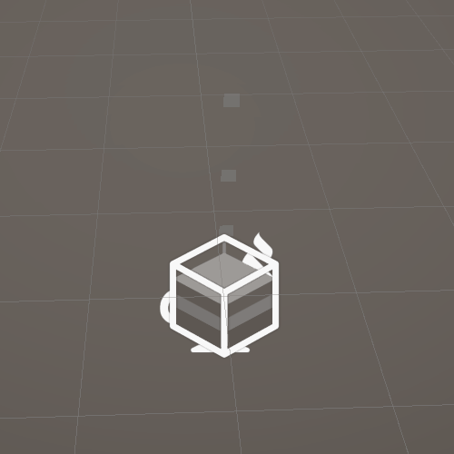
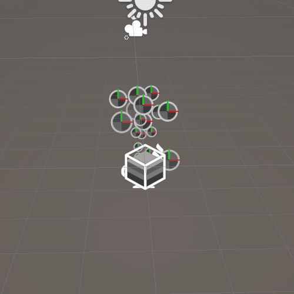
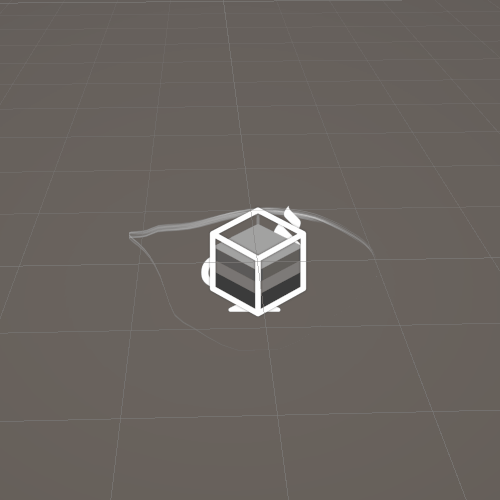
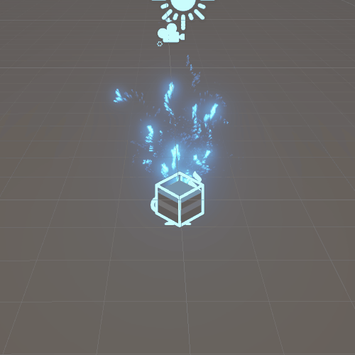

# VFX System
- 시스템은 시각 효과의 스탠드얼론 부분을 정의하는 하나 이상의 컨텍스트를 나타냅니다. 시스템은 파티클 시스템, 파티클 스트립 시스템, 메시 또는 생성 머신일 수 있습니다. 그래프 뷰에서 시스템은 구성되는 컨텍스트 주위에 점선 상자를 그립니다.

# VFX Unity Doc
- [한글 Doc Link](https://docs.unity3d.com/kr/Packages/com.unity.visualeffectgraph@10.8/manual/Systems.html)

# System List
- EmptyParticleSystem
  - 
  - Constant Spawn Rate + Gravity Update Particle
- SimpleParticleSystem
  - 
- SimpleRibbon
  - 
- SimpleSwarmParticleSystem
  - 
- SimpleHeadAndSparks
  - 
- SimpleHeadAndTails
  - 

