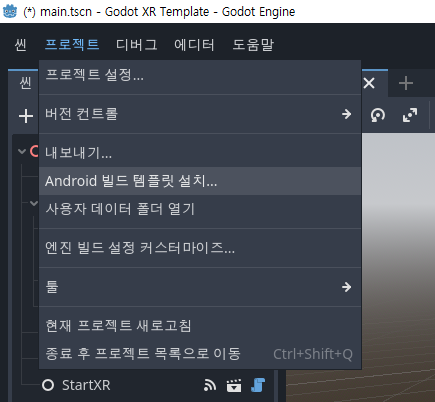

# Godot에서 OpenXR Project 만들기

유니티 라이선스 이슈 터지고 나서 Godot에 관심을 갖게 되었고,
하고 있는 일이 VR 관련 된 업무라서 

- 
- XR 프로젝트를 시작할 때는 XR Project Template을 위 그림과 같은 Godot XR Template를 선택한다.
- 
- 우리는 Meta Quest 에서 돌려볼 예정이기 때문에 Android 빌드 템플릿을 설치한다.
- 
- 실제 내보내기는 Meta Quest를 사용한다.
- 그리고 여기서 중요한게, keystore를 입력해 줘야 한다는 것이다.
- keytool -list -v -alias androiddebugkey -keystore .\debug.keystore 이런식으로 command 실행하고 Password를 입력한다.
- 
- 만약 gradle build 에러가 난다면, 에러 윈도우가 자꾸 닫히는데, 이런 불편을 없애기 위해서는, Godot XR Template\android\build에 gradlew.bat에서 fail 부분에 sleep 5나 pause를 넣어둔다.

그래도 빌드가 안되면서, 아래의 에러 메시지를 보게 되면, 
<pre><code>
  Attempt to open script 'res://components/persistent/persistent_config.gd' resulted in error 'File not found'.
  Failed loading resource: res://components/persistent/persistent_config.gd. Make sure resources have been imported by opening the project in the editor at least once.
</code></pre>
game_config.tres 파일에서 두 줄 삭제
<pre><code>
[ext_resource type="Script" path="res://components/persistent/persistent_config.gd" id="1_v8kip"]
script = ExtResource("1_v8kip")
</code></pre>

- 
- 그러면 위와 같은 실행 결과를 볼 수 있습니다.
